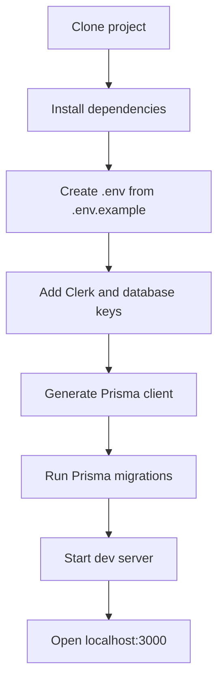
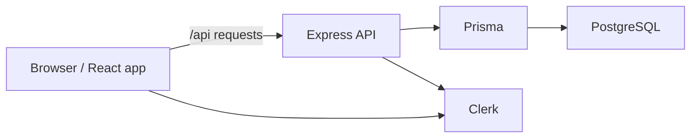
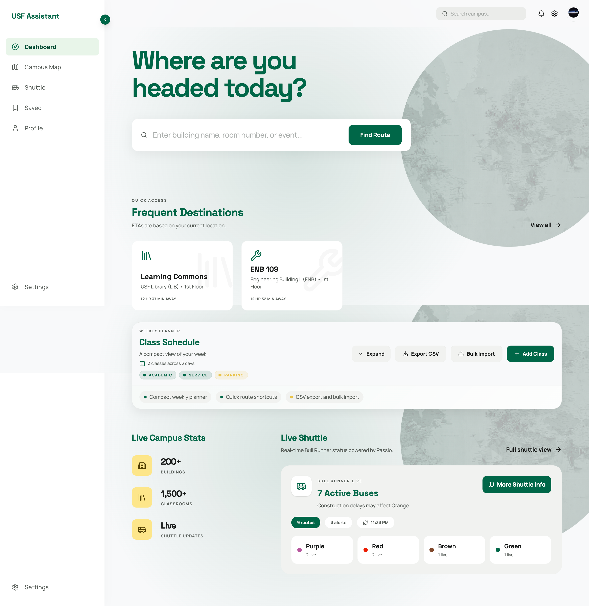
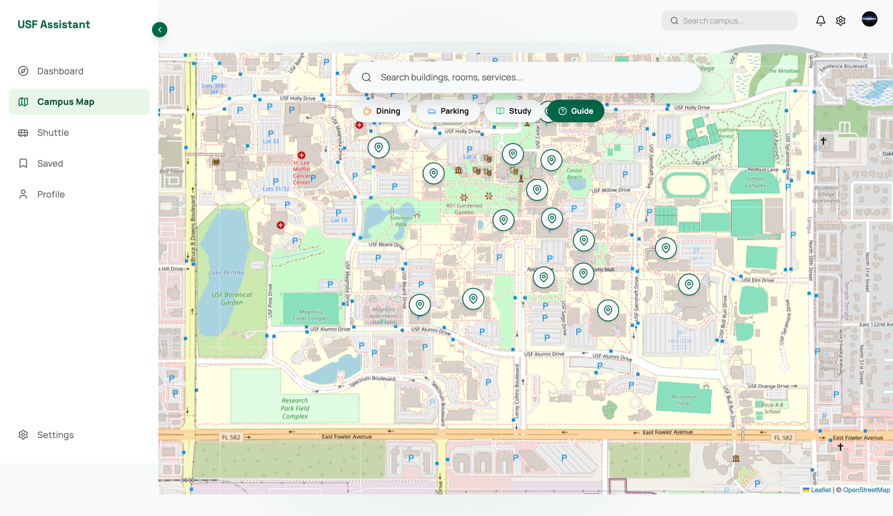
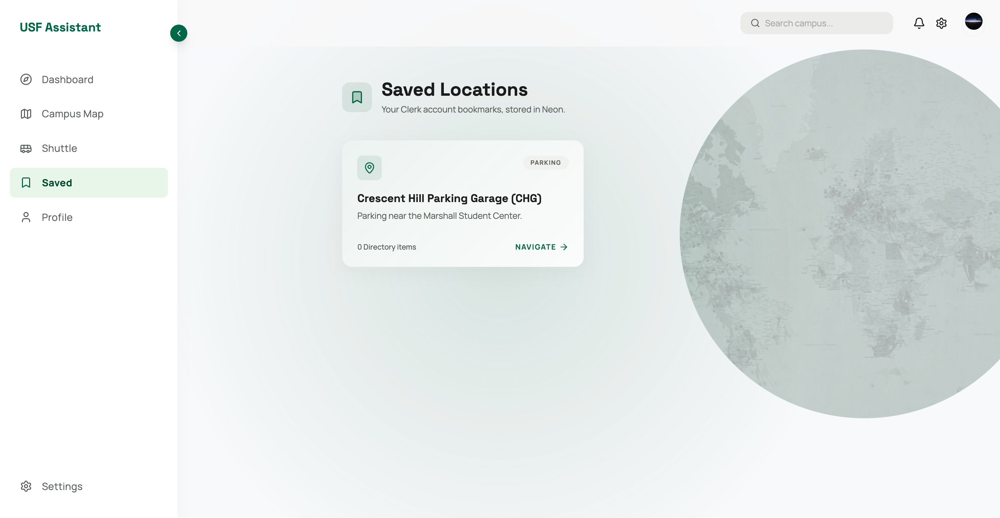
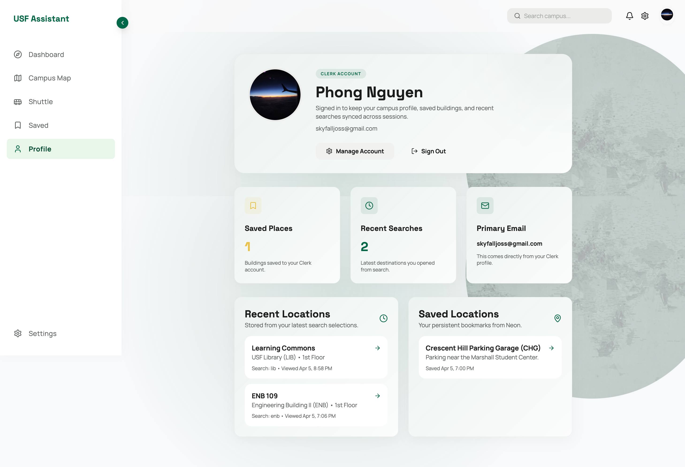

# Campus Navigation Assistant
(https://campus-navigation-assistant.onrender.com/)

> Campus map, shuttle tracking, saved places, and schedule tools in one web app.


Campus Navigation Assistant is a campus map and navigation web app built with React, Express, Prisma, and PostgreSQL. It helps users explore buildings, view shuttle data, save locations, and use authenticated features through Clerk.

## Key Features

- Search campus buildings and rooms
- Explore an interactive campus map
- View shuttle routes and vehicle activity
- Save favorite destinations
- Manage authenticated user features with Clerk
- Store app data with Prisma and PostgreSQL

## What This Project Uses

- React 19
- TypeScript
- Vite
- Express
- Prisma
- PostgreSQL
- Clerk
- Leaflet
- Tailwind CSS v4

## Before You Start

You need:

- Node.js 20 or newer
- npm
- A PostgreSQL database
- Clerk API keys

## Important Note About Apple Devices

- Full development is supported on Windows and macOS.
- iPhone and iPad cannot run the project locally by themselves.
- You can still test the app on iPhone or iPad by running it on your computer and opening it from Safari on the same Wi-Fi network.

## Quick Setup Overview



## Environment Variables

Copy `.env.example` to `.env` and fill in your real values.

Required:

- `VITE_CLERK_PUBLISHABLE_KEY`
- `CLERK_PUBLISHABLE_KEY`
- `CLERK_SECRET_KEY`
- `DATABASE_URL`
- `DIRECT_URL`

Usually keep these local values:

- `PORT="4000"`
- `CORS_ORIGIN="http://localhost:3000"`
- `VITE_API_BASE_URL=""`

Optional:

- `PASSIO_SYSTEM_ID`
- `OPENROUTESERVICE_API_KEY` for real walking routes on the map

## Windows Setup

Use PowerShell.

### 1. Install packages

```powershell
npm install
```

### 2. Create the env file

```powershell
Copy-Item .env.example .env
```

Open `.env` and paste in your Clerk keys and PostgreSQL URLs.

### 3. Generate Prisma client

```powershell
npm run prisma:generate
```

### 4. Run database migrations

```powershell
npm run prisma:migrate:dev
```

### 5. Start the app

```powershell
npm run dev
```

Open:

- Frontend: `http://localhost:3000`
- API: `http://localhost:4000`

## Apple Setup

### macOS Setup

Use Terminal.

#### 1. Install packages

```bash
npm install
```

#### 2. Create the env file

```bash
cp .env.example .env
```

Open `.env` and paste in your Clerk keys and PostgreSQL URLs.

#### 3. Generate Prisma client

```bash
npm run prisma:generate
```

#### 4. Run database migrations

```bash
npm run prisma:migrate:dev
```

#### 5. Start the app

```bash
npm run dev
```

Open:

- Frontend: `http://localhost:3000`
- API: `http://localhost:4000`

### iPhone and iPad Testing

Use this only for testing in the browser.

1. Run `npm run dev` on your Windows PC or Mac.
2. Make sure your computer and iPhone/iPad are on the same Wi-Fi.
3. Find your computer's local IP address.
4. Open `http://YOUR_LOCAL_IP:3000` in Safari.
5. If API requests are blocked, update `CORS_ORIGIN` in `.env`.

The frontend dev server already uses `--host=0.0.0.0`, so it can be opened from other devices on your network.

## How The App Runs



## Commands

- `npm run dev` starts frontend and API together
- `npm run dev:client` starts only the frontend
- `npm run dev:server` starts only the API
- `npm run build` builds the frontend
- `npm run start` runs production migrations and starts the production server
- `npm run start:server` starts only the production server process
- `npm run preview` previews the built frontend
- `npm run lint` runs TypeScript checks
- `npm run test:e2e` runs the Playwright E2E suite against a frontend-only test server with mocked auth and mocked API responses
- `npm run test:e2e:headed` runs the same E2E suite in headed mode
- `npm run test:e2e:install` installs Playwright browsers locally
- `npm run test:load:health` runs a lightweight `autocannon` load test against `/api/health`
- `npm run prisma:generate` regenerates Prisma client
- `npm run prisma:migrate:dev` runs database migrations
- `npm run prisma:migrate:deploy` runs production-safe migrations
- `npm run test:passio` runs the Passio test script

## E2E Testing

The repo now includes a Playwright suite under `tests/e2e`.

- The E2E server uses `npm run dev:client:e2e`, so it starts only the Vite frontend.
- Clerk is replaced with a local stub in `e2e` mode, which keeps the suite independent from real auth setup.
- Shuttle requests are mocked in the browser, so the tests do not depend on the API server, Prisma, Passio, or OpenRouteService.

Run locally:

```bash
npm run test:e2e:install
npm run test:e2e
```

The current suite covers:

- Dashboard rendering and route-search handoff to the map page
- Map search, room selection, empty-state search, and guide dialog
- Settings preferences stored in local storage
- Signed-out states for saved locations and profile screens
- Signed-in saved-location and profile flows with mocked Clerk auth
- Signed-in schedule create, edit, and delete flows with mocked API state
- Mobile-only coverage for bottom navigation and the header map-search shortcut

Playwright projects currently run in:

- Chromium desktop
- Firefox desktop
- WebKit desktop
- Mobile Chrome

## Load Testing

Basic traffic testing is possible, but it should be kept separate from Playwright.

- Use Playwright for correctness and user flows.
- Use `npm run test:load:health` for simple throughput and latency checks against the Express server.
- The default target is `http://127.0.0.1:4000/api/health`, which avoids Clerk, Prisma, Passio, and OpenRouteService dependencies.

Run locally in two terminals:

```bash
npm run dev:server
npm run test:load:health
```

Optional environment variables:

- `LOAD_TEST_URL`
- `LOAD_TEST_CONNECTIONS`
- `LOAD_TEST_DURATION`
- `LOAD_TEST_PIPELINING`

## Project Structure

```text
src/
  components/   Shared UI
  data/         Campus data
  lib/          Helpers and API utilities
  pages/        App screens
server/         Express backend
prisma/         Prisma schema and migrations
```

## Deployment

Recommended free setup:

- Render for the app server
- Neon for PostgreSQL
- Clerk for auth

This repo now includes `render.yaml` so Render can run the frontend and API together as one Node service.

### 1. Create a Neon database

Create a free Neon Postgres project and copy:

- `DATABASE_URL`
- `DIRECT_URL`

### 2. Create a Render web service

1. Push this repo to GitHub.
2. In Render, create a new `Blueprint` or `Web Service` from the repo.
3. Render will detect `render.yaml`.
4. Use the default service settings from the file.

### 3. Add Render environment variables

Set these in Render:

- `DATABASE_URL`
- `DIRECT_URL`
- `CLERK_SECRET_KEY`
- `CLERK_PUBLISHABLE_KEY`
- `VITE_CLERK_PUBLISHABLE_KEY`
- `CORS_ORIGIN`
- `PASSIO_SYSTEM_ID=2343`

For a single Render service, set:

- `CORS_ORIGIN=https://your-render-app.onrender.com`

Do not set `VITE_API_BASE_URL` for this setup. The frontend and API run from the same origin in production.

### 4. Update Clerk settings

In Clerk, add your Render domain to the allowed URLs for:

- frontend app domain
- sign-in / sign-up redirect URLs
- allowed origins if required by your Clerk setup

### 5. Deploy

Render will:

- install dependencies
- generate the Prisma client
- build the Vite frontend
- run Prisma deploy migrations on startup
- start the Express server

The Express server serves both:

- frontend pages
- `/api/*` endpoints

### 6. Open the deployed app

After deploy finishes, open your Render URL and test:

- landing page
- shuttle page
- sign-in flow
- saved locations
- schedule features

## Screenshots

| Screen | Preview |
| --- | --- |
| Dashboard | <br />Main overview screen with shortcuts, schedule, and campus activity highlights. |
| Map | <br />Interactive campus map with building search and navigation support. |
| Shuttle | <br />Live shuttle view showing routes, vehicles, and transit status. |
| Saved | <br />Saved destinations for quick access to frequently used places. |
| Profile | <br />Account and signed-in user experience powered by Clerk. |

## Troubleshooting

### Missing Clerk key

If the app fails with `Missing VITE_CLERK_PUBLISHABLE_KEY.`, your `.env` file is missing the frontend Clerk key.

### API server not working

If the frontend cannot load data, make sure the API is running on port `4000`. The easiest fix is to run `npm run dev`.

### Prisma errors

Check that:

- `DATABASE_URL` is correct
- `DIRECT_URL` is correct
- your PostgreSQL database is reachable

## Notes

- During local development, the frontend proxies `/api` to `http://localhost:4000`.
- `VITE_API_BASE_URL` is only needed if the frontend and API are hosted on different domains.
- Live map routing now depends on `OPENROUTESERVICE_API_KEY`; without it, the map can still load but turn-by-turn walking routes will fail.
- Signed-in features require Clerk to be configured correctly.

## Contributors

- Phong
